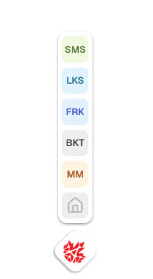

## Atlantix Apps Menu 📱
Web component to display a standard menu for all internal apps.

### Preview 📺



### Implementation 💉
1. Install dependencies
```
npm i atlantix-apps-menu
```
```
npm install @lit/react
```

2. Create wrapper component
`../components/apps-menu-wrapper.tsx`
```ts
import { AtxAppsMenu } from 'atlantix-apps-menu';
import { createComponent } from '@lit/react';
import React from "react";

export const AppsMenuWrapper = createComponent({
  tagName: 'atx-apps-menu',
  elementClass: AtxAppsMenu,
  react: React
});
```

3. Define module type
Create new file at root `types.d.ts`
```ts
declare module 'atlantix-apps-menu';
```

4. Render the component
This web component only will be able to be rendered in a client component. And you can do it this way.

`.your-client-component.tsx`
```ts
'use client';

import dynamic from "next/dynamic";

const AppsMenuComponent = dynamic(() => import('@/components/apps-menu-wrapper').then(mod => mod.AppsMenuWrapper), { ssr: false });

export default function YourPage() {
  return (
    <div className="flex flex-col mx-auto w-3/4 gap-4 mt-40">
      // ... your other TSX code
      <AppsMenuComponent />
    </div>
  )
}
```

That's it 🔥

### About 🧑‍💻
This repository is maintained by everyone at Atlantix Media Inc.
